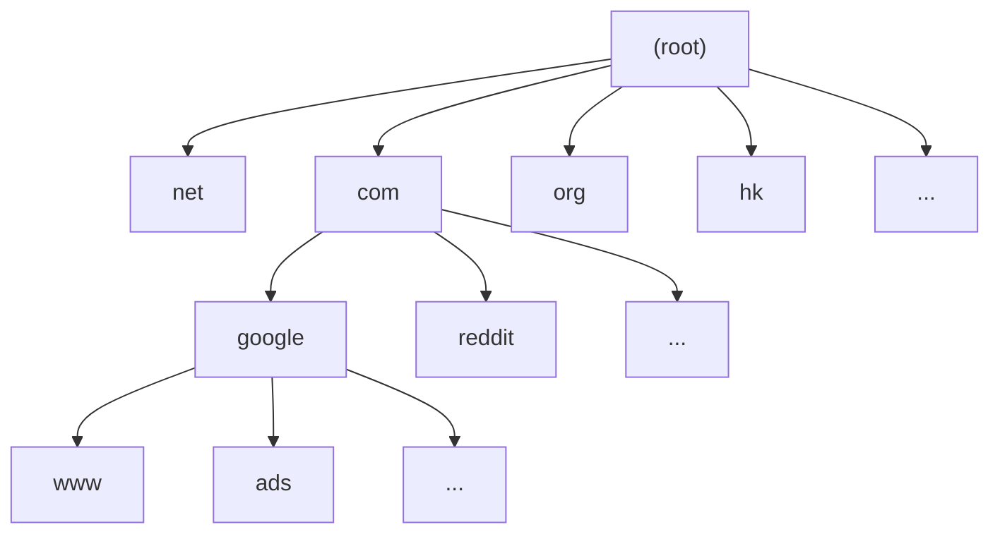
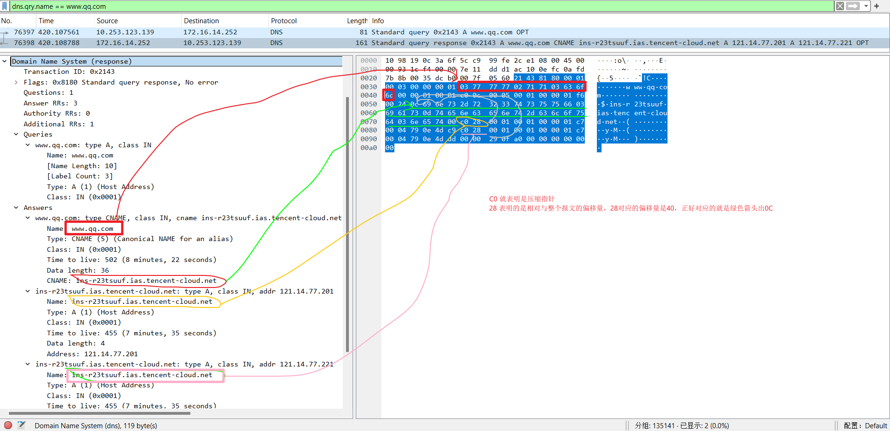

# 从根到未来：理解 DNS 协议及其演进

DNS（Domain Name System）是互联网的“电话簿”，将用户输入的域名解析为 IP 地址。它是一套在分布式架构中高效运行数十年的系统，但在新时代下也面临着新的挑战与变革。本文将从 DNS 的起源出发，逐步讲解其协议细节、特性演进、安全扩展与未来发展方向，帮助读者系统性理解这一互联网基石。

---

## 零、DNS 的起源与发展：从 hosts.txt 到分布式系统

在互联网早期，所有主机名与 IP 的对应关系记录在一个集中式文件 `hosts.txt` 中，由 NIC（Network Information Center）统一管理。这种方式在主机数量有限时尚可维持，但随着互联网的发展迅速变得不可扩展。

1983 年，Paul Mockapetris 提出了 DNS 系统，最初由 [RFC 882](https://datatracker.ietf.org/doc/html/rfc882) 和 [RFC 883](https://datatracker.ietf.org/doc/html/rfc883) 描述，后续演进为核心文档 [RFC 1034](https://datatracker.ietf.org/doc/html/rfc1034) 和 [RFC 1035](https://datatracker.ietf.org/doc/html/rfc1035)。

DNS 设计具有如下特点：

- **分布式架构**：采用分层命名空间（Root → TLD → 权威域名服务器）
- **UDP 优先传输**：默认使用 UDP/53，快速响应
- **无连接性**：查询无状态，便于高并发
- **缓存机制**：中间节点可缓存解析结果，提升性能

---

## 域名的分层结构与组成形式总结

### 一、域名的基本组成

**域名（Domain Name）** 是 DNS 系统中用于标识资源（如主机、服务）的层级式命名方式。

它由一系列 label（标签）组成，**从最具体到最通用（即从左到右）**，中间用点 `.` 分隔：

```
www.example.com.
```

其中：

| 组件      | 含义           | 说明                                |
| --------- | -------------- | ----------------------------------- |
| `www`     | 主机名或子域名 | 最具体，应用定义                    |
| `example` | 二级域（SLD）  | 一般由组织注册                      |
| `com`     | 顶级域（TLD）  | 由 ICANN 分配管理                   |
| `.`       | 根域（Root）   | DNS 层级顶点，协议中用空 label 表示 |

> 注意：`www.example.com` 在日常可用，但在 DNS 协议层必须写成 FQDN（Fully Qualified Domain Name）：`www.example.com.`

### 二、域名的层级结构（由右至左）

| 层级 | 名称            | 举例                          | 特点                         |
| ---- | --------------- | ----------------------------- | ---------------------------- |
| 0    | 根域（Root）    | `.`                           | 不可见、以 `00` 结尾，唯一   |
| 1    | 顶级域（TLD）   | `.com`, `.net`, `.cn`, `.org` | 管理型，由 IANA/ICANN 授权   |
| 2    | 二级域（SLD）   | `example` in `example.com`    | 用户注册单位                 |
| 3+   | 子域名 / 主机名 | `www`, `mail`, `api`          | 可无限扩展，用于组织内部划分 |

层级命名从右至左，每级为一个 label。



---

### 三、协议格式：QNAME 的编码方式（每个 label）

在 DNS 报文中，域名（QNAME）按以下格式编码：

```
[length][label]...[00]
```

例如：`www.example.com.` 编码如下（16 进制）：

| Label     | 编码                      |
| --------- | ------------------------- |
| `www`     | `03 77 77 77`             |
| `example` | `07 65 78 61 6d 70 6c 65` |
| `com`     | `03 63 6f 6d`             |
| 根（空）  | `00`                      |

完整编码：

```
03 77 77 77 07 65 78 61 6d 70 6c 65 03 63 6f 6d 00
```

### 四、特殊说明

#### 1. 根域是空 label，逻辑上存在

- 在协议中表示为 `00`
- 在结构上表示 DNS 树的顶点
- 可用于递归查询起点

#### 2. FQDN vs 相对域名

- `FQDN`：包含根的完全限定域名（以 `.` 结尾）
- `相对域名`：未显式指定根，需要根据上下文补全

| 类型     | 示例               | 是否完整         |
| -------- | ------------------ | ---------------- |
| FQDN     | `www.example.com.` | ✅               |
| 相对域名 | `www.example.com`  | ❌，依赖默认后缀 |

### 五、限制与规范

| 限制                     | 数值/描述                           |
| ------------------------ | ----------------------------------- |
| 每个 label 最大长度      | 63 字节                             |
| 整个域名（含根）最大长度 | 255 字节                            |
| 字符支持                 | `a-z`, `0-9`, `-`（不能开头或结尾） |
| DNS 报文中终止标志       | `0x00`（根）                        |

---

## 二、DNS 协议结构详解

DNS 报文由以下几部分组成：

```
+---------------------+
|        Header       | 12 字节，固定长度
+---------------------+
|       Question      | 可变长度
+---------------------+
|        Answer       | 可变长度
+---------------------+
|      Authority      | 可变长度
+---------------------+
|      Additional     | 可变长度
+---------------------+
```

### 一、Header（固定 12 字节）

```
+--+--+--+--+--+--+--+--+--+--+--+--+--+--+--+--+
|               Transaction ID (16 bits)        |
+--+--+--+--+--+--+--+--+--+--+--+--+--+--+--+--+
|QR|   Opcode  |AA|TC|RD|RA| Z|AD|CD|   RCODE   |
+--+--+--+--+--+--+--+--+--+--+--+--+--+--+--+--+
|                   QDCOUNT (16)                |
+--+--+--+--+--+--+--+--+--+--+--+--+--+--+--+--+
|                   ANCOUNT (16)                |
+--+--+--+--+--+--+--+--+--+--+--+--+--+--+--+--+
|                   NSCOUNT (16)                |
+--+--+--+--+--+--+--+--+--+--+--+--+--+--+--+--+
|                   ARCOUNT (16)                |
+------------------------+----------------------+
```

字段说明：

| 字段               | 位数 | 含义                                                   |
| ------------------ | ---- | ------------------------------------------------------ |
| **Transaction ID** | 16   | 用于匹配请求与响应（客户端生成）                       |
| **QR**             | 1    | 查询 (0) / 响应 (1)                                    |
| **Opcode**         | 4    | 操作码：0 为标准查询，1 为反向查询，2 为服务器状态请求 |
| **AA**             | 1    | 权威回答（仅权威服务器设置为 1）                       |
| **TC**             | 1    | 截断标志（如 UDP 响应超长）                            |
| **RD**             | 1    | 期望递归                                               |
| **RA**             | 1    | 支持递归                                               |
| **Z**              | 1    | 保留，必须为 0                                         |
| **AD**             | 1    | 验证数据标志（DNSSEC）                                 |
| **CD**             | 1    | 禁止验证标志（DNSSEC）                                 |
| **RCODE**          | 4    | 响应码，例如 0：NoError，3：NXDOMAIN                   |
| **QDCOUNT**        | 16   | Question 段的条目数                                    |
| **ANCOUNT**        | 16   | Answer 段的条目数                                      |
| **NSCOUNT**        | 16   | Authority 段的条目数                                   |
| **ARCOUNT**        | 16   | Additional 段的条目数                                  |

### 二、Question 段（查询内容）

每个问题包含三部分：

```
+--+--+--+--+--+--+--+--+--+--+--+--+--+--+--+--+
|                                               |
/                       QNAME                   /
/                                               /
+--+--+--+--+--+--+--+--+--+--+--+--+--+--+--+--+
|                       QTYPE                   |
+--+--+--+--+--+--+--+--+--+--+--+--+--+--+--+--+
|                       QCLASS                  |
+--+--+--+--+--+--+--+--+--+--+--+--+--+--+--+--+
```

| 字段       | 长度  | 描述                                                                                      |
| ---------- | ----- | ----------------------------------------------------------------------------------------- |
| **QNAME**  | 可变  | 查询的域名，用 label 编码，例如 `www.google.com.`                                         |
| **QTYPE**  | 16 位 | 查询类型，如 A (1), AAAA (28), MX (15) ，完整信息见下面的 `DNS Resource Record TYPE` 部分 |
| **QCLASS** | 16 位 | 查询类，一般为 IN（Internet, 值为 1） ，很少见到其他值，所以无需过度关注                  |

**QNAME 编码方式**：见上面第一部分描述

### 三、Answer / Authority / Additional 段结构

这三段的记录格式都是相同的 **资源记录（Resource Record, RR）** 格式：

```
  0  1  2  3  4  5  6  7  8  9  A  B  C  D  E  F
+--+--+--+--+--+--+--+--+--+--+--+--+--+--+--+--+
|                                               |
/                                               /
/                      NAME                     /
|                                               |
+--+--+--+--+--+--+--+--+--+--+--+--+--+--+--+--+
|                      TYPE                     |
+--+--+--+--+--+--+--+--+--+--+--+--+--+--+--+--+
|                     CLASS                     |
+--+--+--+--+--+--+--+--+--+--+--+--+--+--+--+--+
|                      TTL                      |
|                                               |
+--+--+--+--+--+--+--+--+--+--+--+--+--+--+--+--+
|                    RDLENGTH                   |
+--+--+--+--+--+--+--+--+--+--+--+--+--+--+--+--|
/                     RDATA                     /
/                                               /
+--+--+--+--+--+--+--+--+--+--+--+--+--+--+--+--+
```

| 字段         | 长度  | 描述                                                       |
| ------------ | ----- | ---------------------------------------------------------- |
| **NAME**     | 可变  | 所属的域名，与前面提到的 QNAME 形式和编解码一致            |
| **TYPE**     | 16 位 | 记录类型，完整信息见下面的 `DNS Resource Record TYPE` 部分 |
| **CLASS**    | 16 位 | 一般为 IN（1）                                             |
| **TTL**      | 32 位 | 生存时间（秒）                                             |
| **RDLENGTH** | 16 位 | RDATA 的长度                                               |
| **RDATA**    | 可变  | 实际记录内容（依 TYPE 不同而不同）                         |

#### DNS Resource Record TYPE 列表

| 类型码 | 类型名     | 说明                                     | 常用                 |
| ------ | ---------- | ---------------------------------------- | -------------------- |
| **1**  | A          | IPv4 地址记录（返回 4 字节 IPv4 地址）   | ✅ 是                |
| **2**  | NS         | Name Server，指定权威域名服务器          | ✅ 是                |
| **5**  | CNAME      | Canonical Name，别名记录                 | ✅ 是                |
| **6**  | SOA        | Start of Authority，权威区域起始记录     | ✅ 是                |
| **12** | PTR        | 指针记录，常用于反向解析                 | ✅ 是                |
| **15** | MX         | Mail Exchange，邮件交换记录              | ✅ 是                |
| **16** | TXT        | 文本记录，可包含任意信息（如 SPF、DKIM） | ✅ 是                |
| **28** | AAAA       | IPv6 地址记录（返回 16 字节 IPv6 地址）  | ✅ 是                |
| **33** | SRV        | 服务定位记录（常用于 SIP、LDAP 等）      | ✅ 是                |
| **35** | NAPTR      | 名称授权指针（与 SRV 配合使用）          | ⚠️ 中等              |
| **36** | KX         | 密钥交换记录（Key Exchanger）            | ❌ 罕见              |
| **37** | CERT       | 公钥证书记录                             | ❌ 罕见              |
| **38** | A6         | IPv6 地址（已废弃，改用 AAAA）           | ❌ 已废弃            |
| **39** | DNAME      | 域名别名（类似 CNAME 但作用于子域）      | ⚠️ 中等              |
| **41** | OPT        | EDNS0 的扩展记录，不是传统 RR            | ✅ 是（EDNS 专用）   |
| **43** | DS         | Delegation Signer（DNSSEC 用）           | ✅ 是                |
| **46** | RRSIG      | 资源记录签名（DNSSEC）                   | ✅ 是                |
| **47** | NSEC       | 下一记录指针（DNSSEC）                   | ✅ 是                |
| **48** | DNSKEY     | 公钥记录（DNSSEC）                       | ✅ 是                |
| **50** | NSEC3      | 增强版 NSEC，防止区域枚举（DNSSEC）      | ✅ 是                |
| **51** | NSEC3PARAM | 控制 NSEC3 行为的参数                    | ✅ 是                |
| **52** | TLSA       | DANE 安全协议记录                        | ⚠️ 中等（DANE 使用） |
| **53** | SMIMEA     | S/MIME 证书记录（加密邮件）              | ❌ 罕见              |
| **55** | HIP        | Host Identity Protocol                   | ❌ 罕见              |
| **59** | CDS        | Child DS，子域 DNSSEC 自动更新           | ⚠️ 新增              |
| **60** | CDNSKEY    | Child DNSKEY，DNSKEY 自动下发            | ⚠️ 新增              |
| **61** | OPENPGPKEY | OpenPGP 公钥记录                         | ❌ 罕见              |
| **62** | CSYNC      | 区域同步记录（主从同步）                 | ❌ 罕见              |
| **63** | ZONEMD     | 区域完整性校验（RFC 8976）               | ❌ 新                |
| **64** | SVCB       | Service Binding（替代 SRV，用于 HTTPS）  | ✅ 新兴              |
| **65** | HTTPS      | 特化的 SVCB，用于 HTTPS 优化解析         | ✅ 新兴              |

##### 私有用途 / 特殊用途

| 类型码          | 类型名   | 说明                             |
| --------------- | -------- | -------------------------------- |
| **250**–**254** |          | 实验类型                         |
| **255**         | ANY      | 查询所有类型（不能用于授权数据） |
| **65280–65534** |          | 私有使用                         |
| **65535**       | Reserved | 保留                             |

### 四、Answer / Authority / Additional 区别

| 段名           | 内容含义                                                  | 用途                        |
| -------------- | --------------------------------------------------------- | --------------------------- |
| **Answer**     | 直接回答客户端查询的问题                                  | 解析器最终结果              |
| **Authority**  | 指示负责该域名的权威服务器                                | 用于递归迭代，指向下一跳 NS |
| **Additional** | 补充信息，常为 Authority 中 NS 的 A 记录或 EDNS0 OPT 记录 | 减少客户端查询次数          |

#### 示例：

查询 `www.example.com` 的 A 记录，响应中可能有：

- Answer: A 记录 `93.184.216.34`
- Authority: NS 记录 `ns1.example.com`
- Additional: A 记录 `192.0.2.53`（即 ns1.example.com 的地址）

### 五、指针压缩机制（域名压缩）

在 DNS 报文中，域名经常重复出现（如 Question、Answer、Authority、Additional 区中都有可能包含相同的域名）。

为了**节省空间**，DNS 协议允许对域名使用一种“指针压缩机制”来引用报文中已有的域名。

#### 域名编码的两种形式：

1. **标准编码（未压缩）**：
   每个标签以其长度前缀组成，结尾以 `0x00` 终止
   例如：`www.example.com.` 编码为：

   ```
   [03] w w w [07] e x a m p l e [03] c o m [00]
   ```

2. **压缩编码（Pointer）**：
   使用一个**指针**（两字节）来代替整个域名或域名的后缀：

   - 格式：`11xxxxxx xxxxxxxx`（共 2 字节）
   - 即：**高两位为 `11`，表示这是一个指针**
   - **后 14 位**是偏移量，指向报文中的其他位置

#### 示例讲解

设某 DNS 报文中：

**Question 区：**

```
0x00: 03 77 77 77 07 65 78 61 6d 70 6c 65 03 63 6f 6d 00  // www.example.com.
```

**Answer 区：**

```
0x12: c0 0c    // 指针 c00c → 偏移到 0x0c 处，即上面的域名
00 01  // TYPE A
00 01  // CLASS IN
...
```

解析步骤：

1. `c0 0c`：

   - `c0` = `11000000` 表示这是一个指针
   - `0c` 是指向 `0x0c` 的偏移

2. 所以这一处的域名是引用 Question 区的 `www.example.com.`

#### 关键点总结

| 项目         | 说明                                                          |
| ------------ | ------------------------------------------------------------- |
| 指针标志     | `11`（即高两位为 `1`）表示压缩指针                            |
| 指针长度     | 固定 2 字节                                                   |
| 指针位置     | 可以出现在任何域名字段中，常用于 Answer、Authority 等重复域名 |
| 指针偏移     | 相对于报文头部 0 字节位置计算                                 |
| 不能递归指针 | 指针指向的数据必须是原始 label 编码，不得再含指针             |
| 可以混合     | 当前 label 编码后，后续使用指针，例如：`[03]www [pointer]`    |

#### 💡 示例



#### 不可做的事

- ❌ 压缩指针不能指向其他压缩指针（只能指向 label 串的起点）
- ❌ 不能在 Question 区使用压缩（RFC 1035 建议避免）
- ❌ 偏移量超出实际报文长度将被认为是格式错误（格式无效）

#### 参考来源

- [RFC 1035 §4.1.4 — Message compression](https://datatracker.ietf.org/doc/html/rfc1035#section-4.1.4)
- 实际抓包工具如 Wireshark 可直观显示指针跳转

## 三、DNS 特性的变化：从简单解析到安全增强

DNS 的核心功能几十年未变，但在以下方面已发生明显演进：

| 方面     | 初始设计          | 演进现状                                   |
| -------- | ----------------- | ------------------------------------------ |
| 报文大小 | UDP 最多 512 字节 | EDNS0 支持大报文                           |
| 安全性   | 无签名、无认证    | 引入 DNSSEC、DoT、DoH                      |
| 数据传输 | 明文 UDP          | 支持 TLS（DoT）、HTTPS（DoH）、QUIC（DoQ） |
| 性能机制 | 基于缓存          | ECS 精准定位、递归并发优化                 |

---

## 四、DNS 遇到的问题与应对方案

### 1. 缓存投毒（Cache Poisoning）

**问题**：攻击者伪造响应包，使解析器缓存错误记录
**解决**：

- 随机化 Query ID、源端口
- 启用 DNSSEC（响应签名）
- 使用 0x20 大小写混淆提高熵

### 2. UDP 报文截断

**问题**：响应超过 512 字节会被截断（TC=1）
**解决**：使用 [EDNS0](https://datatracker.ietf.org/doc/html/rfc6891) 扩展支持大包，必要时回退到 TCP

### 3. 安全传输缺失

**问题**：查询内容被中间人监听、篡改
**解决**：

- DoT（DNS over TLS）：加密 TCP
- DoH（DNS over HTTPS）：封装在 HTTP/2 中
- DoQ（DNS over QUIC）：低延迟加密传输（[RFC 9250](https://datatracker.ietf.org/doc/html/rfc9250)）

---

## 五、递归解析实现注意事项

递归解析器从根开始迭代查询最终结果。实现时应注意：

1. **CNAME 链跟进**：若返回 CNAME，应递归继续查 A 记录
2. **NS 与 Additional 优化**：优先使用附加中的 A 记录，减少查询次数
3. **TTL 缓存控制**：不同记录缓存策略可能不同，避免缓存无效或过期
4. **死循环检测**：检查 NS→CNAME→NS 环导致循环解析
5. **负载控制**：限制并发查询数，防止被利用进行 DDoS

---

## 六、EDNS0 与 DNSSEC 的实现机制

### 1. EDNS0（Extension Mechanisms for DNS）

由 [RFC 6891](https://datatracker.ietf.org/doc/html/rfc6891) 定义，是通过“伪记录”扩展 DNS 功能的方式。主要用途：

- **扩展 UDP 包长**（如最大 4096 字节）
- **传递附加元信息**（如 ECS 客户端子网）
- **支持 DNSSEC 标志位 DO（DNSSEC OK）**

一个典型 OPT 记录如下：

```
; EDNS: version: 0, flags: do; udp: 4096
```

### 2. DNSSEC（DNS Security Extensions）

由 [RFC 4033-4035](https://datatracker.ietf.org/doc/html/rfc4033) 定义，解决响应验证问题：

- 每个记录集（RRSet）都有对应签名（RRSIG）
- 区域有公钥（DNSKEY），其哈希上链为 DS 记录
- 顶层信任锚由操作系统或解析器内置（root KSK）

DNSSEC 引入的新记录：

| 类型             | 描述                 |
| ---------------- | -------------------- |
| `RRSIG`          | 签名记录             |
| `DNSKEY`         | 公钥                 |
| `DS`             | 上级指纹             |
| `NSEC` / `NSEC3` | 用于证明“记录不存在” |

---

## 七、DNS 的现状挑战与未来方向

### 当前面临的问题

| 问题               | 描述                           |
| ------------------ | ------------------------------ |
| **隐私泄露**       | 明文传输暴露查询意图           |
| **运营商劫持**     | 拦截 DNS 并伪造解析            |
| **CDN 定位偏差**   | 递归服务器离用户较远，影响调度 |
| **安全部署不普及** | DNSSEC 等机制部署率仍低        |

### 未来发展趋势

1. **默认加密传输**（DoH、DoT、DoQ 普及）
2. **隐私增强技术**：如 ODoH（Oblivious DoH，RFC 9230）
3. **轻量级安全方案**：如 QNAME minimization（RFC 7816）
4. **本地权威缓存**：提升性能并减轻根负载
5. **多路径与负载均衡解析**：增强容错与抗攻击能力
